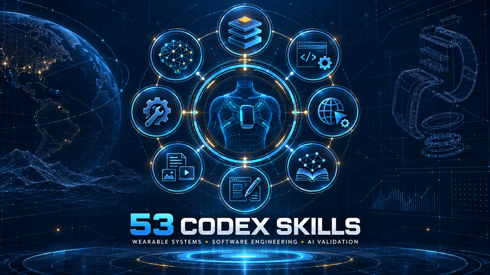

# 53 Codex Skills 分享文案

## 繁體中文版

我整理、安裝並驗證了一套 **53 個 Codex Skills** 的工程工作集，現在已公開在 GitHub 分享。

這套工作集主要面向我日常負責的穿戴系統架構、程式開發與 AI 系統驗證，涵蓋：

- SoC、PCB、機構與系統架構審查
- 程式開發、Debug、TDD、Code Review 與 CI/CD
- Playwright Web 自動測試與瀏覽器自動化
- Obsidian 工程知識庫與結構化資料
- Figma、UI/UX、技術文件、簡報與多媒體
- AI 評測、LLM Judge、本機模型、GGUF 與模型訓練流程
- MCP／CLI 工程資料介面

目前 **53/53 個 Skill 均已通過本機結構與已知命令依賴檢查**，備份可重複安裝，並附有 SHA-256 清單、驗證腳本、分類說明及使用限制。

GitHub：<https://github.com/johnson68878-ops/codex-skills-backup>

歡迎參考、交流或依自己的工程環境調整。各 Skill 的原作者及授權條款仍以其上游來源為準。

## 简体中文版

我整理、安装并验证了一套 **53 个 Codex Skills** 的工程工作集，现在已经公开在 GitHub 分享。

内容覆盖穿戴系统架构、SoC／PCB／机构审查、程序开发、Debug、Web 自动测试、工程知识库、MCP／CLI 数据接口，以及 AI 评测、本地模型与训练流程。当前 **53/53 个 Skill 已通过本机结构和已知命令依赖检查**，仓库同时提供可重复安装脚本、SHA-256 清单、分类说明和验证报告。

GitHub：<https://github.com/johnson68878-ops/codex-skills-backup>

欢迎参考和交流。第三方 Skill 的作者与授权条款以各自上游来源为准。

## English version

I assembled, installed and verified a collection of **53 Codex Skills** for wearable-system architecture, software engineering and AI validation, and I have now made the collection available on GitHub.

It covers system and hardware reviews, development and testing workflows, browser automation, engineering knowledge systems, MCP/CLI interfaces, AI evaluation, local GGUF models and model-training workflows. All **53/53 Skills pass the local structure and known-command dependency audit**, with reproducible installation scripts, SHA-256 manifests and a detailed verification report included.

GitHub: <https://github.com/johnson68878-ops/codex-skills-backup>

Contributions and technical discussion are welcome. Third-party Skills retain their original authorship and license terms.

## 建議標籤

`#Codex` `#AgentSkills` `#AIEngineering` `#WearableTechnology` `#SystemArchitecture` `#LLMEvaluation` `#MCP` `#Automation` `#OpenSource`
