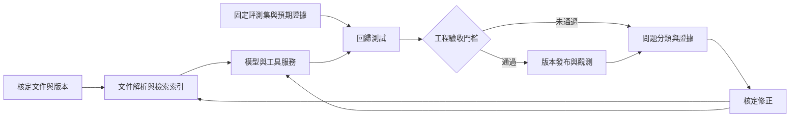

# 46 個 Skills：穿戴系統架構、程式開發與 AI 驗證適用性分析

分析日期：2026-09-13。範圍為本次備份的 46 個個人 Skill 根目錄，不含 `.system`、外掛 Skills，也不把 Remotion 內部子模組重複計數。用途以本機各 `SKILL.md`、附帶腳本與資源為依據；優先級及工作流程是針對穿戴系統架構工程工作的建議，並非經實測的效能排名。

## 主要判斷

這套組合已能支援需求拆解、寫程式、Debug、程式碼審查、架構文件與技術簡報。最值得補強的是 **AI 的固定評測集與回歸驗證、工程知識庫的來源與版本管理、硬體測試資料的自動匯入，以及系統需求到測試結果的追溯**。

46 個 Skill 不等於 46 套已配置完成的工具，更不代表已訓練出離線模型。多數是操作規則、範本或程式入口；真正執行還取決於 Python/Node、CLI、模型端點、儀器介面或服務權限。

對目前工作，建議常用 `soc-architecture`、`pcb-eda-review`、`mechanical-cad-review`、`cli-creator`、`jupyter-notebook`、`systematic-debugging`、`test-driven-development`、`verification-before-completion`；其他依任務叫用。AI 驗收則優先補 `evaluation`，而非再增加一組通用開發流程 Skill。

## 1. 46 個 Skill 逐項分析

「高」表示與所述職務直接相關；「中」表示特定情境有價值；「低」表示可保留但不是當前補強重點。若工作重心轉向 App UI 或對外展示，對應分類的優先級應提高。表中輸出是可協助產生的成果，不表示已連接公司的系統。

### A. 硬體與系統架構：3 個

| # | Skill／本機備份來源 | 核心功用與產出 | 適合的穿戴工程場景 | 限制與優先級 |
|---|---|---|---|---|
| 1 | [soc-architecture](../skills/soc-architecture/SKILL.md) | 拆解系統、介面、記憶體、時脈、重置、電源域及頻寬／延遲預算；產出架構規格、介面矩陣與待確認事項。 | 感測器→MCU／SoC→手機／雲端的分工；建立 always-on 與高效能運作情境、啟動順序和資料流。 | **高。** 偏 SoC 架構，可支援整機分析但不是完整穿戴產品規格庫；估算不能當成實測或實體設計收斂證據。 |
| 2 | [pcb-eda-review](../skills/pcb-eda-review/SKILL.md) | 依原理圖、BOM、netlist、DRC、stack-up 等證據檢查電路／PCB 問題，形成問題與證據表。 | 比對電源樹、reset／clock、感測介面、板改版影響；彙整 EE 設計審查。 | **高。** 需要可讀匯出；不能把截圖審查當成完整 Allegro／OrCAD／PADS 資料庫解析，更不能取代 SI／PI 或 EMC 測試。 |
| 3 | [mechanical-cad-review](../skills/mechanical-cad-review/SKILL.md) | 依圖面、BOM、STEP 等資料檢視裝配、尺寸、公差、材料及製造風險。 | 穿戴裝配空間、感測器開孔、連接器配合、熱路徑及工程變更討論。 | **高。** 支援 Creo／SOLIDWORKS 證據審查，不代表能直接操控所有原生模型；強度、密封與量產能力仍需工程驗證。 |

### B. 開發、分析與交付：17 個

| # | Skill／來源 | 核心功用與產出 | 你的實際用法 | 限制與優先級 |
|---|---|---|---|---|
| 4 | [brainstorming](../skills/brainstorming/SKILL.md) | 釐清需求、使用情境、限制與方案，再決定設計。 | 開始做測試平台前先確定輸入、責任邊界、成功條件。 | **中。** 有明確設計確認流程；已授權的簡單工作不宜重複進行冗長訪談。 |
| 5 | [writing-plans](../skills/writing-plans/SKILL.md) | 把核定方向拆成檔案、步驟、驗證方式與可執行工作單。 | 拆解 log parser、測試 API、儀器 adapter、CI 接入等交付。 | **高。** 是實施計畫，不會自動證明設計合理；與持續進度紀錄分工使用。 |
| 6 | [planning-with-files](../skills/planning-with-files/SKILL.md) | 用 task_plan、findings、progress 保存計畫、發現與進度。 | 長週期驗證、跨日 Debug、保留假設與未解問題。 | **高。** 持久筆記不是模型訓練；hook 能否執行依宿主支援。本次補建三個缺漏模板。 |
| 7 | [executing-plans](../skills/executing-plans/SKILL.md) | 讀取已存在的計畫並逐步執行、驗證及交付。 | 接手另一輪已整理好的程式開發工作單。 | **中。** 與多代理執行方案擇一，不需要同時套兩套進度管理。 |
| 8 | [subagent-driven-development](../skills/subagent-driven-development/SKILL.md) | 將實作與檢查分派給不同代理，按工作單推進。 | 模組界面已固定後，分開開發 parser、API、前端與測試。 | **中。** 需要宿主提供子代理工具；增加調度與 token 成本，小改動未必划算。 |
| 9 | [dispatching-parallel-agents](../skills/dispatching-parallel-agents/SKILL.md) | 把互不相依的問題並行調查，再整合證據。 | 同時分析不同測試台、互不相干的 CI 失敗。 | **中。** 不適合多個代理同時改同一檔案或彼此依賴的故障鏈。 |
| 10 | [using-git-worktrees](../skills/using-git-worktrees/SKILL.md) | 檢查或建立隔離 Git 工作目錄。 | 保留穩定版同時試做新功能，分開維護不同平台版本。 | **高。** 檔案隔離不等於資料庫、儀器或外部服務隔離。 |
| 11 | [test-driven-development](../skills/test-driven-development/SKILL.md) | 先建立失敗測試，再做最小修改並回歸。 | 固定 log 解析、單位轉換、計算邊界與協定封包處理。 | **高。** 傳統單元測試不能完全覆蓋 LLM 的隨機性、幻覺與檢索品質。 |
| 12 | [systematic-debugging](../skills/systematic-debugging/SKILL.md) | 重現→搜集證據→形成假設→驗證根因→修復。 | 間歇掉線、版本回歸、資料錯位、AI API 失敗定位。 | **高。** 必須有 log、版本或可重現條件；避免憑合理敘事斷言硬體根因。 |
| 13 | [code-review](../skills/code-review/SKILL.md) | 以固定 diff 基準分別檢查規範與需求符合度。 | 發版前查實作是否符合 issue／spec。 | **高。** 假定提供基準與規範；內含專案流程檔案假設，需適配實際 repository。 |
| 14 | [requesting-code-review](../skills/requesting-code-review/SKILL.md) | 組織 review 的範圍、上下文與檢查者。 | 要求独立檢查測試工具與重大修改。 | **中。** 主要是安排 review，和 code-review 的實際檢查有重疊，不必層層重複叫用。 |
| 15 | [receiving-code-review](../skills/receiving-code-review/SKILL.md) | 先核實 reviewer 的判斷，再逐項修正及測試。 | 處理跨軟硬體團隊對時序、錯誤處理與資料格式的意見。 | **高。** 協助處理意見，不能用來略過必要的實測或責任人裁決。 |
| 16 | [verification-before-completion](../skills/verification-before-completion/SKILL.md) | 要求在宣稱完成前提出當下驗證結果。 | 每次交付附版本、測試命令、pass／fail、未涵蓋範圍。 | **高。** 是證據紀律，不內建公司測試規格；需先定義驗收條件。 |
| 17 | [finishing-a-development-branch](../skills/finishing-a-development-branch/SKILL.md) | 測試通過後處理合併、PR 或保留分支等收尾。 | 發布測試工具與穩定版更新。 | **中。** 需遵循實際分支保護、簽核及使用者已決定的交付方式。 |
| 18 | [cli-creator](../skills/cli-creator/SKILL.md) | 將 API、SDK 或既有腳本包成可組合 CLI，提供穩定 JSON、認證及錯誤契約。 | 建立 test-results、ci-logs、device-info 等工具，讓 AI 用結構化介面讀資料。 | **高。** 很符合工程工具開發；仍需接入真實 API／驅動並測試，並非自動具備儀器控制權。 |
| 19 | [gh-fix-ci](../skills/gh-fix-ci/SKILL.md) | 讀取 GitHub Actions 失敗檢查與日誌，定位修復方向。 | GitHub 上的程式回歸、建置與驗證失敗。 | **高／條件式。** 若公司使用 Jenkins／GitLab CI，不能直接照搬；需要對應 adapter。需 gh 與倉庫權限。 |
| 20 | [jupyter-notebook](../skills/jupyter-notebook/SKILL.md) | 建立可重跑的實驗／教學 notebook。 | 分析耗電曲線、延遲分位數、失敗率、模型比較及資料分布。 | **高。** 提供實驗結構，統計方法與品質仍需設計；正式流水線宜抽出成可測試模組。 |

### C. 內容取得、瀏覽與證據：5 個

| # | Skill／來源 | 功用 | 工程場景 | 限制與優先級 |
|---|---|---|---|---|
| 21 | [agent-reach](../skills/agent-reach/SKILL.md) | 按平台與可用 backend 路由搜尋、文章及討論取得。 | 查公開技術資料、開源專案與生態資訊。 | **中。** 第三方 CLI／登入狀態另行配置；社群說法不能直接作為設計簽核依據。 |
| 22 | [firecrawl](../skills/firecrawl/SKILL.md) | 搜尋、抓取、站點探索、結構化擷取與監測。 | 有授權的公開文件收集、比較多版本網頁規格。 | **中。** CLI／API 配置及服務成本需確認；與單頁擷取功能重疊。 |
| 23 | [defuddle](../skills/defuddle/SKILL.md) | 清除网页導航雜訊，擷取乾淨 Markdown。 | 將公開技術文章整理成可引用資料。 | **中。** 適合單頁清理，不是企業 RAG 平台，也不是完整瀏覽器測試器。 |
| 24 | [browser-use](../skills/browser-use/SKILL.md) | 透過 CDP 操作需互動或 JS 的瀏覽器頁面。 | 驗證內部 Web 工具的操作、擷取動態畫面。 | **中。** 本機是 browser-harness 類 CLI 流程；需實際 runtime。操作成功不等於有可重播的端到端回歸測試。 |
| 25 | [screenshot](../skills/screenshot/SKILL.md) | 擷取桌面、視窗或局部畫面作為證據。 | 保存 UI 錯誤、儀器畫面和前後對照。 | **中。** 圖片不包含完整資料與條件，不能取代原始 log；也不是 CAD 解析。 |

### D. 個人知識整理：4 個

| # | Skill／來源 | 功用 | 工程場景 | 限制與優先級 |
|---|---|---|---|---|
| 26 | [obsidian-markdown](../skills/obsidian-markdown/SKILL.md) | 產生帶屬性、內鏈、引用區塊的 Obsidian 筆記。 | 記錄架構決策、問題根因及技術筆記。 | **中。** 文字格式規則不會自動建立公司權限、文件版本治理或 RAG。 |
| 27 | [obsidian-cli](../skills/obsidian-cli/SKILL.md) | 對執行中的 Obsidian 讀寫、搜尋與管理筆記。 | 將已核定設計結論存入個人 vault。 | **中。** 需 Obsidian 開啟及 CLI 可用；不要把個人 vault 當成團隊核定文件的唯一來源。 |
| 28 | [obsidian-bases](../skills/obsidian-bases/SKILL.md) | 建立 `.base` 篩選、公式及資料檢視。 | 管理 issue、元件比較或文件狀態。 | **中。** 是筆記資料視圖，不能取代有存取控制與交易一致性的工程資料庫。 |
| 29 | [json-canvas](../skills/json-canvas/SKILL.md) | 建立節點、連線、群組組成的 `.canvas`。 | 梳理系統資料流、故障樹草圖與架構關係。 | **中。** 可畫關係，不會替你驗證電氣連接或時序正確。 |

### E. UI 與設計：4 個

| # | Skill／來源 | 功用 | 工程場景 | 限制與優先級 |
|---|---|---|---|---|
| 30 | [frontend-design](../skills/frontend-design/SKILL.md) | 建立一致、有主題的前端視覺與版面。 | 測試 dashboard、資料瀏覽器、工具入口。 | **中。** 偏視覺，不能替代功能、可及性或資料正確性驗證。 |
| 31 | [ui-ux-pro-max](../skills/ui-ux-pro-max/SKILL.md) | 用本機設計資料庫選擇色彩、字體、版型與互動規則。 | 改善資訊密集的測試結果頁、篩選與錯誤提示。 | **中。** 有本機檢索腳本；對工程內部工具應以資訊可辨識與操作效率為優先。 |
| 32 | [figma](../skills/figma/SKILL.md) | 用 Figma MCP 取得設計、變數與素材，支援轉成程式。 | 已有 App／工具設計稿時對齊實作。 | **中／條件式。** 需 Figma MCP 和文件權限；只有 Skill 檔案不代表已接通 Figma。 |
| 33 | [superdesign](../skills/superdesign/SKILL.md) | 在設計 canvas 上建立及迭代 UI 草稿、頁面流程。 | 開發前比較測試平台的操作方案。 | **低至中。** 需其工具服務；與前兩項部分重疊，不必為每個小工具都跑完整設計流程。 |

### F. 簡報、影音與寫作：9 個

| # | Skill／來源 | 功用 | 工程場景 | 限制與優先級 |
|---|---|---|---|---|
| 34 | [codex-ppt](../skills/codex-ppt/SKILL.md) | 把內容做成風格統一的整頁圖片 PPTX。 | 方向溝通、概念展示、簡短技術簡報。 | **中。** 一頁主要是一張圖；需要可修改文字、表格與圖形的正式規格簡報時不宜選它。 |
| 35 | [guizang-ppt-skill](../skills/guizang-ppt-skill/SKILL.md) | 生成單 HTML 翻頁簡報，含演講者畫面與註記。 | 技術分享或現場 demo。 | **低至中。** 不等於可編輯 PowerPoint；離線展示需檢查字型與外部資源。 |
| 36 | [image-to-editable-ppt](../skills/image-to-editable-ppt/SKILL.md) | 重建圖片／掃描簡報為物件級可編輯 PPTX。 | 只有圖片時還原需要修改的流程圖與頁面。 | **中。** OCR、圖形與數值須人工校對；有 editppt runtime 及可能的 OCR／模型依賴。 |
| 37 | [hyperframes](../skills/hyperframes/SKILL.md) | 路由 HTML 動畫與影片製作，按時間軸渲染。 | 展示產品資料流或工具操作概念。 | **低。** 入口會要求其他專用工作流；不是安裝此一目錄就具備完整影片工具鏈。 |
| 38 | [remotion-best-practices](../skills/remotion-best-practices/SKILL.md) | 路由 React／Remotion 的影片、資產、渲染等做法。 | 用程式生成一致的 demo 影片。 | **低。** 與 HyperFrames 依輸出框架擇一；Node、渲染環境另行準備。 |
| 39 | [speech](../skills/speech/SKILL.md) | 透過附帶程式產生文字轉語音。 | 製作 demo 旁白、測試提示音素材。 | **低至中。** 是雲端 API 工作流，需 API key；不代表已具備穿戴端 TTS 或離線語音能力。 |
| 40 | [transcribe](../skills/transcribe/SKILL.md) | 語音轉文字，可做分段／說話者標籤。 | 將允許處理的錄音整理為文字草稿。 | **中。** 本機版使用 API；技術術語與人名需要校對，不能宣稱完全离线處理。 |
| 41 | [humanizer](../skills/humanizer/SKILL.md) | 改寫僵化、公式化的文字，保留原意。 | 英文報告、評審意見與技術摘要。 | **中。** 不查證事實；工程數值、需求用語及不確定性不得被修辭改掉。 |
| 42 | [humanizer-zh](../skills/humanizer-zh/SKILL.md) | 針對中文調整冗詞、語氣與常見 AI 文風。 | 中文週報、跨團隊說明、簡報講稿。 | **中。** 與 humanizer 高度重疊；依語言選擇即可，不必連續反覆潤飾。 |

### G. Skill 發現與管理：4 個

| # | Skill／來源 | 功用 | 工程場景 | 限制與優先級 |
|---|---|---|---|---|
| 43 | [awesome-skills](../skills/awesome-skills/SKILL.md) | 從即時整理清單尋找能力，回到原始來源核對。 | 尋找真正補足測試或分析缺口的工具。 | **中。** 收錄不等於品質驗證；不可只按熱門程度或名稱決定。 |
| 44 | [find-skills](../skills/find-skills/SKILL.md) | 透過 Skills 生態與 CLI 搜尋可安裝項目。 | 當現有清單沒有專項時再搜尋。 | **中。** 與 awesome-skills 功能重疊，適合作為另一搜尋入口。 |
| 45 | [using-superpowers](../skills/using-superpowers/SKILL.md) | 協助在工作開始時找合適的流程 Skill。 | 提醒在實作前選擇驗證與規劃流程。 | **低至中。** 是路由規則，不新增工程演算法；觸發範圍很廣，可能增加流程成本。 |
| 46 | [writing-skills](../skills/writing-skills/SKILL.md) | 把重複方法写成可重用 Skill，並以情境測試檢查指令。 | 固化團隊已驗證的架構檢查、測試報告與 triage 方法。 | **高。** 應先有穩定流程與範例，再抽成 Skill；寫了一份規則不等於流程有效。 |

## 2. 重複功能與使用分工

首次匯入的 34 個 Skill 與原個人目錄重名 1 個 `frontend-design`，與 GitHub 外掛快取重名 1 個 `gh-fix-ci`；後者內容不同。此次 46 個個人來源之間沒有同名根目錄。功能重疊與檔案相同是兩件事，本次未刪除任何一組。

| 重疊群 | 建議分工 |
|---|---|
| brainstorming／writing-plans／planning-with-files | 分別負責方案、工作單、持續紀錄；一個任務共用一份事實與進度來源。 |
| executing-plans／subagent-driven-development／dispatching-parallel-agents | 選單代理執行或多代理執行；平行調查只用在獨立問題。 |
| code-review／requesting-code-review／receiving-code-review | 分別是檢查、發起檢查、處理意見，避免同一 diff 無限重審。 |
| agent-reach／firecrawl／defuddle／browser-use | 分別偏平台路由、站點擷取、單頁清理、互動頁面；一般 API／文件不必動瀏覽器。 |
| frontend-design／ui-ux-pro-max／superdesign／figma | 先決定是否已有設計稿；工程 dashboard 優先資訊與操作，視覺探索按需要追加。 |
| codex-ppt／guizang-ppt-skill／image-to-editable-ppt | 按「整頁圖片 PPTX／HTML 演講／圖片重建成可編輯 PPTX」選擇。 |
| hyperframes／remotion-best-practices | 按 HTML 或 React 影片框架選一套。 |
| humanizer／humanizer-zh | 以內容語言選擇；兩者都不負責事實核驗。 |
| awesome-skills／find-skills | 先查已整理清單，再補生態搜尋，最後看來源與維護說明。 |

有些 Skill 的觸發文字非常廣。例如影片入口可能也涵蓋互動簡報，設計 Skill 可能要求先做 canvas，流程 Skill 可能要求多次確認。實際使用應以明確任務、宿主能力和既有授權裁定，不能把所有流程都疊加在每項工作上。

## 3. 已安裝檔案與執行依賴

本次完成兩層驗證。第一層確認 46 個來源目錄已備份、清單與內容一致、能從 Git 快照還原；第二層檢查 46 個 Skill 的本機 Markdown 參照及已知命令依賴。健康檢查結果為 **46／46、零斷鏈、零缺少已知命令**。這代表本機入口已備妥，不代表每個外部帳號、網站、公司儀器及雲端 API 都已授權。

已安裝並驗證的重點 runtime 包括 Node.js、npm／npx、Python、uv、Graphviz、ImageMagick、FFmpeg／FFprobe、`browser-use`、`browser-harness`、`firecrawl`、`defuddle`、`hyperframes`、`agent-reach`、`mcporter`、`yt-dlp`、`editppt` 與 Obsidian CLI。實際 smoke test 已通過 Browser Use 隔離 Chrome/CDP 開頁、Defuddle 擷取、Agent Reach 經 Exa 搜尋、Obsidian CLI、editppt doctor、codex-ppt doctor，以及 GitHub CLI 登入狀態。Figma 官方外掛已安裝並啟用，需在新任務或重啟 Codex 後載入工具並連接帳號。

仍需使用者帳號或服務權限的項目：Firecrawl 與 Superdesign 登入；Speech／Transcribe 的 `OPENAI_API_KEY`；Figma 文件權限；社群平台 cookies／OpenCLI 擴充；以及讓 Browser Use 接管日常 Chrome 時手動啟用 remote debugging。YouTube 的公開 smoke test 遇到網站反機器人登入要求。這些屬於外部認證或網站限制，不能由 Skill 檔案及 PATH 安裝取代。完整證據見 [驗證報告](verification-2026-09-13.md)。

## 4. 額外值得補的現有 Skills

先查閱 [awesome-skills 即時清單](https://github.com/ningzimu/awesome-skills)，再閱讀候選的原始 Skill／README。下列推薦是角色適配判断；本輪僅研究，**沒有新增安裝**，所以備份仍為 46 個。第三方路徑可能隨版本更新，安裝時應釘住核對過的 commit 並包含相依資源。

| 優先順序 | 候選與原始來源 | 相較現有 46 個的增量 | 適合的第一個試點／依賴 |
|---|---|---|---|
| 1 | [evaluation](https://github.com/muratcankoylan/Agent-Skills-for-Context-Engineering/blob/main/skills/evaluation/SKILL.md) | 為 Agent 建立確定性檢查、評分維度、基線及回歸門檻，補傳統單元測試不足。 | 固定一組工程問答／log 分析案例，對比兩個版本的正確性、證據及成本。仍需實作評測 runner。 |
| 2 | [webapp-testing](https://github.com/anthropics/skills/blob/main/skills/webapp-testing/SKILL.md) | 用 Playwright 流程測試本機 Web app；比臨時手動瀏覽更適合反覆執行的 UI 驗證。 | 測試上傳 log→顯示解析結果→篩選→下載報告；需要 Python／Playwright 及測試瀏覽器。 |
| 3 | [mcp-builder](https://github.com/anthropics/skills/blob/main/skills/mcp-builder/SKILL.md) | 建立讓 AI 呼叫服務的 MCP server；與 cli-creator 的 CLI 介面形成不同接入方式。 | 先做只讀的 test-result／spec-search 工具，訂好參數、結果 schema 與錯誤處理。需公司 API 與部署方式。 |
| 4 | [huggingface-local-models](https://github.com/huggingface/skills/blob/main/skills/huggingface-local-models/SKILL.md) | 協助 GGUF 選擇、量化及 llama.cpp 本機模型服務。 | 先跑本機公開模型 smoke test，再量測記憶體與延遲。它不會自動讓下載、遙測或所有外部連線離線化。 |
| 5 | [advanced-evaluation](https://github.com/muratcankoylan/Agent-Skills-for-Context-Engineering/blob/main/skills/advanced-evaluation/SKILL.md) | 深化 LLM-as-judge、成對比較、評分規準校準和偏差控制。 | 工程專家先標註一批答案，再校準自動評審；硬數值優先用程式檢查，不全交給另一個 LLM。 |
| 6 | [huggingface-community-evals](https://github.com/huggingface/skills/blob/main/skills/huggingface-community-evals/SKILL.md) | 原始文件目前定位為透過 inspect-ai／lighteval 在本機評估模型。 | 比較本機模型與推理 backend；要有可用 GPU／runtime，Windows 支援須依實際 backend 核對。通用 benchmark 不能取代公司案例。 |
| 後續 | [huggingface-llm-trainer](https://github.com/huggingface/skills/blob/main/skills/huggingface-llm-trainer/SKILL.md) | 涵蓋 SFT／DPO 等訓練工作流。 | 目前原始 Skill 主要依 Hugging Face Jobs 雲端 GPU，並非公司離線訓練的直接方案。只有資料、算力與部署路徑明確後再評估。 |

若先補三個，選 `evaluation`、`webapp-testing`、`mcp-builder`。若當前任務就是建立本機模型服務，可把第三項換成 `huggingface-local-models`。這是依工作目標排序，而非認為更多 Skill 一定帶來更好結果。

另外，[Ragas 的官方指標清單](https://docs.ragas.io/en/stable/concepts/metrics/available_metrics/)列有 context precision／recall、faithfulness、工具呼叫等評估項目，適合知識庫問答驗證；它是評測工具／函式庫，**不是本次已核對並安裝的 Skill**。可將實際採用的測試方式封裝成公司自己的 Skill。

## 5. 對穿戴架構工作，更有價值的自訂 Skills

以下是建議開發的能力名稱，**不是聲稱已存在的公開套件**。應建立在部門已核定的流程、資料契約和真實範例上。通用 Skill 很難預先知道你的測試台、資料欄位與責任邊界。

| 建議自訂項目 | 必要輸入 | 應交付的產物 | 驗證方式 |
|---|---|---|---|
| wearable-system-review | 系統需求、架構圖、介面表、版本、測試情境 | 需求→子系統→介面→測試的追溯表；假設、風險及責任人欄位 | 用已結案設計案例回放，檢查遺漏與誤報。 |
| power-budget-analysis | 各模式電流、電壓、占空比、電池資料、温度及量測條件 | 模式耗電表、續航估算、敏感度與預算差異 | 單位與加總自動檢查，並與實測比對；避免把理想電池容量當成所有條件可用容量。 |
| test-log-triage | 結構化 log、DUT／韌體／治具版本、測試條件與判定規則 | 失敗分類、原始證據位置、疑似根因、下一個最小實驗 | 重播已標註案例；將觀察與根因假設分開，未知類別允許回報未知。 |
| engineering-rag-validation | 有版本與權限的工程文件、標準問答、引用位置、模型／索引設定 | 檢索與答案分項分數、錯版引用、缺證據及越權案例 | 使用固定留出集；數值與版本做確定性檢查，再人工抽查與模型評分。 |
| device-interface-regression | 已授權裝置介面、協定說明、測試環境、可重置條件 | BLE／串列／其他介面的測試案例與可重播結果 | 在隔離測試設備上執行；真實連線、斷線恢復及狀態轉移必須實測。 |

我會先做 `test-log-triage` 和 `engineering-rag-validation`：兩者直接連到「寫工具」與「確認 AI 系統是否有用」，而且容易建立可重複量測的交付標準。硬體介面、功耗與裝置類型目前未提供，不能假定所有產品都有相同的 BLE、音訊或感測器需求。

## 6. 先分清知識更新、RAG、微調與持續學習

| 方式 | 實際改變 | 合適的目的 | 你需要驗證的事 |
|---|---|---|---|
| 更新 Skill／prompt | 工作指令、輸出格式與工具用法 | 讓操作與報告一致 | 指令路由是否正確、是否漏步驟、成本有沒有不必要上升。 |
| 更新知識庫／RAG | 文件與檢索內容，通常不改模型權重 | 讓答案使用最新核定規格並能引用 | 找到對的文件、版本、權限與段落；答案是否被證據支持。 |
| 微調模型 | 模型權重或 adapter | 改善穩定的任務模式、領域表達或格式 | 和未微調基線比較；檢查泛化、資料洩漏、遺忘與部署成本。 |
| 回饋驅動持續改善 | 可先改文件、檢索、prompt 或工具，必要時才改權重 | 把真實失敗轉成可驗證改進 | 先審核回饋、固定評測、分階段發布與可回退，不讓未核定答案自動變成事實。 |

這個區分有助於溝通「模型學到了什麼」：把新文件寫進 Wiki 不代表訓練了模型；本機推理也不等於完成了微調。訓練 Skill 的原始文件明確描述訓練方法與雲端 Jobs，而本機模型 Skill 描述的是模型取得與服務，兩者角色不同。[訓練來源](https://github.com/huggingface/skills/blob/main/skills/huggingface-llm-trainer/SKILL.md)、[本機服務來源](https://github.com/huggingface/skills/blob/main/skills/huggingface-local-models/SKILL.md)。

建議先改善有引用、可追溯的 RAG。對經常更新的規格，容易檢查來源與撤回錯版資料通常比立即微調更符合工程驗證需求。這是本報告的工程判斷，實際仍須以你的測試集比較。

## 7. 建議的 AI 驗證閉環



每次測試至少綁定：`case_id`、資料來源版本、模型／adapter／prompt 版本、embedding／索引版本、程式 commit、輸入、預期證據、實際輸出、分項得分及原始 trace。裝置測試另綁定 DUT、韌體、治具和條件。這是建議資料契約，不是宣稱公司已具備的欄位。

建議第一批用 50–100 個經工程師審核的案例作試點起點，依主題與難度分層；這個數量不是足夠性的統計保證。案例涵蓋一般查詢、跨文件比較、版本衝突、缺資料、單位／數值、不可回答及工具失敗。先留出不參與調整的驗證集；同一文件的近似改寫不要分散到訓練與驗證兩側造成洩漏。

驗收維度應至少分開看：

1. **檢索**：是否找得到核定段落，引用版本及存取範圍是否正確。
2. **答案**：數值、單位、推論和引用一致；缺證據時是否承認未知。
3. **任務**：程式輸出 schema、計算結果與最終狀態是否符合契約。
4. **穩定性**：重複執行的成功率與變異，服務／工具失敗時能否恢復。
5. **效率**：相同負載下的 p50／p95 延遲、token／資源與成本；本機推理另看記憶體。
6. **工程門檻**：嚴重錯誤不能被平均分掩蓋，門檻由項目責任人依風險設定。

先用確定性程式檢查數值、schema 和證據檔案，再用人工或模型評分處理語意，符合 `evaluation` 的先後次序。[原始 evaluation Skill](https://github.com/muratcankoylan/Agent-Skills-for-Context-Engineering/blob/main/skills/evaluation/SKILL.md)。用 LLM 評審時還要以人工標註校準，避免僅因答案更長、更像標準答案就得高分。[原始 advanced-evaluation Skill](https://github.com/muratcankoylan/Agent-Skills-for-Context-Engineering/blob/main/skills/advanced-evaluation/SKILL.md)。

## 8. 四週試點建議

這是討論用節奏，未建立排程或自動化，實際需依資料與環境調整。

| 階段 | 工作 | 驗收產物 |
|---|---|---|
| 第 1 週 | 選一種 log 或一組文件問答，明確定義輸入、正解／證據及目前人工基線。 | 資料契約、案例集 v1、錯誤分類與版本表。 |
| 第 2 週 | 用 cli-creator／jupyter-notebook 建立讀取與分析；補固定評測 runner。 | 相同資料能重跑，逐案例結果可追溯。 |
| 第 3 週 | 接入實際模型／檢索；一次比較一個主要變因。 | 基線比較報告、失敗樣本、延遲／成本和人工抽查。 |
| 第 4 週 | 接上實際 CI，設定檢查門檻與回退方式，再讓小範圍使用。 | 不通過不能自動發布；問題可定位到資料、prompt、程式或模型版本。 |

先用一個具體場景做出可量化的改善，再擴到更多產品。若手上沒有模型服務，先以 deterministic parser＋工程查詢工具完成資料鏈路也有價值，不必等訓練平台成熟。

## 9. 備份與證據範圍

本次來源為 `.codex/skills` 45 個與 `.agents/skills` 的 agent-reach 1 個。雙來源更新與驗證可用：

```powershell
.\scripts\update-backup.ps1 -AdditionalSkillsRoot "$env:USERPROFILE\.agents\skills"
.\scripts\verify.ps1 -AdditionalSkillsRoot "$env:USERPROFILE\.agents\skills"
```

還原到新電腦時，安裝器把 46 個全放進 `.codex/skills`。同名但內容不同的舊版先備份；再執行普通 verify。外掛清單只記錄檔案位置，不是可攜帶的帳號授權。

原 `planning-with-files` 遺漏模板已由自帶初始化程式補建。這次 Git 快照保留修復版雜湊及換行保護；原始缺漏版與修復版本不可當成完全相同。研究結果沒有修改這 46 個 Skill 的上游設計規則，也沒有安裝推薦候選。

本文件只包含通用職務場景與公開研究，不包含聊天截圖、人名、內部對話、工程規格、原始測試資料或帳號凭證。分析屬工作方法建議，不能取代實際產品的設計及發布驗收。
